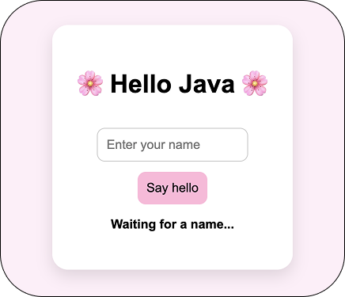

# Java to Browser with TeaVM

## What this repo is actually doing

This project explores a genuinely weird and interesting idea: what if you could write Java — real Java, with classes and methods and all the things Java people love — and have it run inside a web browser?

Browsers don't speak Java. They never have. The web runs on JavaScript, and for a long time that was the end of the conversation. But a tool called [TeaVM](https://teavm.org/) changes that. It takes your compiled Java bytecode and translates it into JavaScript that any browser can load and run. The Java logic stays Java. TeaVM handles the translation.

This repo builds that idea up step by step. You start with a plain Java method on your machine, and by the end that same method is running in a browser tab — no plugins, no server, no tricks.

---

## Important: this is Java compiled to JavaScript, not WebAssembly (yet)

The name of this repo says `wasm` and that is intentional — it hints at where this is going. But right now, the current state of the code compiles Java to **JavaScript**, not WebAssembly.

Here is what that means in practice:

- **WebAssembly (WASM)** is a binary format that browsers can run at near-native speed. It is the "real" future of running non-JavaScript languages in browsers. TeaVM can target it.
- **JavaScript** is what TeaVM is currently configured to produce here. It is slower and bulkier than WASM, but it works in every browser with no extra setup.

The `targetType` in `pom.xml` is currently set to `JAVASCRIPT`. Switching it to `WASM` is the natural next step for this project, but it is not done yet. So when you run `mvn teavm:compile`, you get a `classes.js` file, not a `.wasm` file. That JavaScript file contains your compiled Java logic and a small Java runtime bundled together. The browser loads it, and your Java method becomes callable from the web page.

The reason this matters: if you look at the output and think "this doesn't look like WebAssembly", that is correct. It isn't. Not yet.

---

## Prerequisites — what you need installed before anything else

You need two things on your machine: Java 17 and Maven. Here is what each one is and how to get it.

### Java 17

Java is a programming language that has been around since 1995. When you write Java code, you don't compile it directly into machine code for your specific computer. Instead, it compiles into something called **bytecode** — a neutral format that runs on the **Java Virtual Machine (JVM)**. The JVM is a program that lives on your machine and knows how to execute that bytecode. This is why Java has always had the "write once, run anywhere" reputation: the same bytecode runs on Windows, Mac, and Linux as long as the JVM is installed.

Java 17 is a **Long-Term Support (LTS)** release, which means it gets security updates and bug fixes for many years. It is a stable, widely-used version and a sensible choice for any new project.

**To check if you already have Java installed:**

```bash
java -version
```

If you see something like `openjdk version "17.x.x"`, you are good. If you see an older version (11, 8, etc.) or a `command not found` error, you need to install or upgrade.

**Option 1 — Download directly from Oracle:**

Go to [https://www.oracle.com/uk/java/technologies/downloads](https://www.oracle.com/uk/java/technologies/downloads) and download the installer for Java 17. Run it and follow the steps.

**Option 2 — Install via Homebrew (recommended on Mac):**

```bash
brew install openjdk@17
```

After installing, follow any instructions Homebrew prints about adding Java to your PATH. It usually looks something like:

```bash
echo 'export PATH="/opt/homebrew/opt/openjdk@17/bin:$PATH"' >> ~/.zshrc
source ~/.zshrc
```

**Verify after installing:**

```bash
java -version
javac -version
```

Both commands should report version 17. `java` runs programs; `javac` is the compiler that turns your `.java` source files into `.class` bytecode files.

**If you have multiple Java versions installed and need to switch to 17:**

On Mac with Homebrew:

```bash
export JAVA_HOME=$(/usr/libexec/java_home -v 17)
```

Add that line to your `~/.zshrc` to make it permanent.

---

### Maven — what it is and what `pom.xml` does

Maven is a **build tool** for Java projects. Without it, compiling and running a Java project involves a lot of manual steps: finding the right `.java` files, running `javac` with the right flags, managing dependencies (external libraries your code needs), and packaging everything up. Maven automates all of that.

You describe your project in a file called `pom.xml` — **Project Object Model** — and Maven reads that file to know what to do. Think of `pom.xml` as the recipe for your project.

Here is what `pom.xml` tells Maven in this project:

- **groupId, artifactId, version** — the identity of the project. `groupId` is like a namespace (usually a reversed domain name, here just `demo`), `artifactId` is the project name, and `version` is the current version.

- **`properties`** — configuration values reused across the file. Here it sets `maven.compiler.source` and `maven.compiler.target` to `17`, which tells Maven to compile the code using Java 17 syntax and produce bytecode compatible with Java 17.

- **`dependencies`** — external libraries your project needs. Maven downloads these automatically from a central registry called [Maven Central](https://central.sonatype.com/). In this project, the dependencies are the TeaVM libraries that let you use `@JSExport` and give you access to the TeaVM standard library.

- **build and plugins** — extra tools that extend Maven's behaviour. The TeaVM Maven plugin is configured here. It tells Maven: when `mvn teavm:compile` is run, use TeaVM to compile the `demo.Main` class and write the output to the `docs/` folder as a file called `classes.js`.

**To check if Maven is installed:**

```bash
mvn -v
```

**To install Maven on Mac via Homebrew:**

```bash
brew install maven
```

**To install Maven manually:** download the binary from [https://maven.apache.org/install.html](https://maven.apache.org/install.html), unzip it, and add the `bin` folder to your PATH.

---

## Step 1 — Create and run a Java program locally

A minimal Java program is created and run on your machine using Maven.

**Project structure at this stage:**

```text
.
├── docs/
├── src/
│   └── main/
│       └── java/
│           └── demo/
│               └── Main.java
├── pom.xml
└── README.md
```

Maven compiles `.java` source files into `.class` bytecode files that the Java Virtual Machine (JVM) can execute.

**Compile the project:**

```bash
mvn compile
```

**Run the program:**

```bash
mvn exec:java -Dexec.mainClass="demo.Main"
```

**Expected output:**

```text
Hello World from Java 🌸
```

---

## Step 2 — Refactor into a reusable method

The greeting logic is moved into a method called `helloName(name)`. This makes it possible to call the same logic from a web page later.

```java
package demo;

public class Main {

    public static String helloName(String name) {
        if (name == null || name.trim().isEmpty()) {
            return "Hello World from Java 🌸";
        }
        return "Hello " + name + " from Java 🌸";
    }

    public static void main(String[] args) {
        System.out.println(helloName("You"));
    }
}
```

At this stage the name is still hard-coded (`"You"`). The user cannot enter their own name yet.

---

## Step 3 — Add a web page

A simple HTML page is added to the `docs/` folder. It contains an input field and a button for displaying a personalised greeting.

**File added:**

```text
docs/index.html
```

The page is served via GitHub Pages (from the `docs/` folder). At this stage the greeting logic is not yet connected to Java — that comes in later steps.

**Preview:**



---

## Step 4 — Add temporary JavaScript greeting logic

A JavaScript file is added to make the page interactive. It duplicates the greeting logic from the Java method so the page works before the Java compilation is set up.

**File added:**

```text
docs/script.js
```

This is a temporary stand-in. The JavaScript version of `helloName` will be replaced once TeaVM compiles the real Java method for the browser.

---

## Step 5 — Compile Java for the browser using TeaVM

TeaVM is added to the Maven project. It reads the compiled Java bytecode and produces a JavaScript file that the browser can load.

**Why TeaVM?**

Browsers cannot run Java bytecode. TeaVM acts as a compiler that translates your Java classes into JavaScript. The `@JSExport` annotation on `helloName` tells TeaVM to make that method available as a global JavaScript function.

**TeaVM Maven plugin — [documentation](https://teavm.org/docs/tooling/maven.html)**

The plugin is configured in `pom.xml` to output a file called `classes.js` into the `docs/` folder:

```xml
<targetType>JAVASCRIPT</targetType>
<targetDirectory>docs</targetDirectory>
<targetFileName>classes.js</targetFileName>
```

**Run TeaVM:**

```bash
mvn teavm:compile
```

**File produced:**

```text
docs/classes.js
```

This file contains the entire Java runtime and your compiled `helloName` method. When `index.html` loads it, `helloName` becomes available as a global function — so the button on the page calls your Java code, running inside the browser.

The temporary `script.js` version is no longer needed once `classes.js` is in place.
